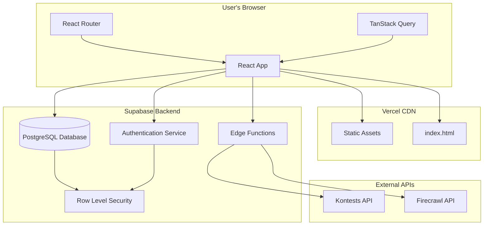
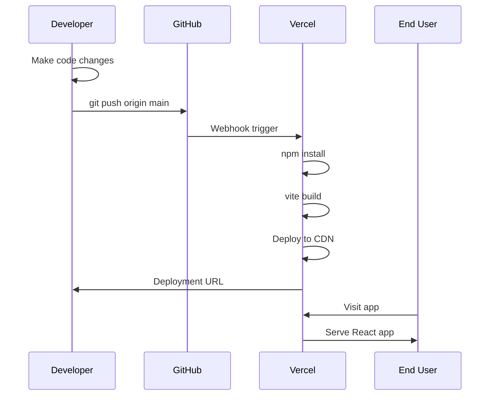
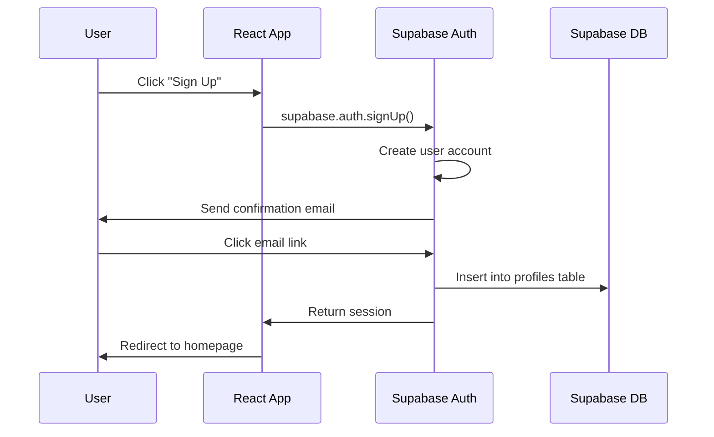
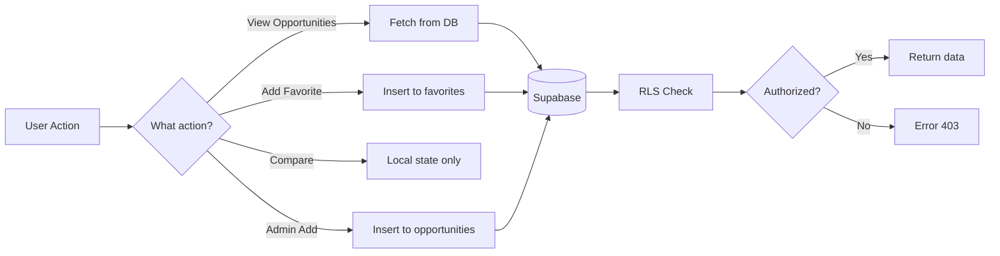

<p align="center">
  
</p>

<h1 align="center">LaunchPad</h1>

<p align="center">
  <strong>🚀 Discover Hackathons, Internships & Coding Contests</strong>
</p>

<p align="center">
  <a href="https://opportune.vercel.app">Live Demo</a> •
  <a href="#features">Features</a> •
  <a href="#quick-start">Quick Start</a> •
  <a href="#tech-stack">Tech Stack</a>
</p>

<p align="center">
  
  
  
  
  
</p>

---

## ✨ What is LaunchPad?

**LaunchPad** is a one-stop platform that aggregates **hackathons**, **coding contests**, and **internships** from 50+ sources worldwide. Built for students and developers who want to discover opportunities without checking multiple websites.

### 🎯 Key Highlights

- **70+ Opportunities** - Curated hackathons, contests, and internships
- **Real-time Updates** - Live data from Codeforces, Devfolio, MLH, Unstop & more
- **Smart Filtering** - Filter by type, deadline, location, and search
- **Compare Tool** - Side-by-side comparison of up to 3 opportunities
- **Favorites** - Save opportunities to your personal list
- **AI Ideas** - Get project ideas and interview prep tips

---

## 🚀 Features

### For Students & Developers

| Feature | Description |
|---------|-------------|
| 🔍 **Smart Search** | Search by title, company, or tags |
| 🏷️ **Filter by Type** | Hackathons, Internships, or Contests |
| 📅 **Deadline Sorting** | Never miss a deadline |
| ⚡ **Compare Tool** | Compare up to 3 opportunities side-by-side |
| ❤️ **Favorites** | Save opportunities to your profile |
| 💡 **Get Ideas** | AI-powered project ideas & prep guides |
| 📱 **Mobile Ready** | Responsive design for all devices |
| 🌙 **Dark Mode** | Easy on the eyes |

### For Admins

- **Admin Panel** - Add/edit/delete opportunities
- **User Management** - Manage admin roles
- **Database Control** - Full CRUD operations

---

## 🖼️ Screenshots

<details>
<summary>Click to view screenshots</summary>

### Home Page
The main dashboard showing all opportunities with filters and search.

### Opportunity Card
Each card shows title, deadline, prize, location, and quick actions.

### Compare Modal
Side-by-side comparison of selected opportunities.

### Admin Panel
Manage opportunities with full CRUD functionality.

</details>

---

## ⚡ Quick Start

### Prerequisites

- Node.js 18+ 
- npm or bun

### Installation

```bash
# Clone the repository
git clone https://github.com/yadavnikhil17102004/LaunchPad.git
cd LaunchPad

# Install dependencies
npm install

# Start development server
npm run dev
```

The app will be running at `http://localhost:8080`

### Environment Variables

Create a `.env` file in the root:

```env
VITE_SUPABASE_URL=your_supabase_url
VITE_SUPABASE_PUBLISHABLE_KEY=your_supabase_anon_key
```

---

## 🛠️ Tech Stack

### Frontend
- **React 18** - UI framework with hooks
- **TypeScript** - Type-safe development
- **Vite** - Lightning-fast build tool
- **TailwindCSS** - Utility-first styling
- **Radix UI** - Accessible component primitives
- **shadcn/ui** - Beautiful component library
- **React Router** - Client-side routing
- **TanStack Query** - Server state management

### Backend
- **Supabase** - PostgreSQL + Auth + Edge Functions
- **Supabase Edge Functions** - Serverless data aggregation

### Data Sources
| Source | Type | Status |
|--------|------|--------|
| Codeforces API | Contests | ✅ Live |
| Firecrawl | Web Scraping | ✅ Live |
| Curated List | Hackathons | ✅ 50+ events |
| Curated List | Internships | ✅ 20+ programs |

---

## 📁 Project Structure

```
LaunchPad/
├── src/
│   ├── components/       # React components
│   │   ├── ui/          # shadcn/ui components
│   │   ├── Header.tsx
│   │   ├── OpportunityCard.tsx
│   │   ├── OpportunityGrid.tsx
│   │   └── ...
│   ├── hooks/           # Custom React hooks
│   │   ├── useOpportunities.tsx
│   │   ├── useAuth.tsx
│   │   ├── useFavorites.tsx
│   │   └── useCompare.tsx
│   ├── pages/           # Route pages
│   │   ├── Index.tsx
│   │   ├── Auth.tsx
│   │   ├── Admin.tsx
│   │   └── Favorites.tsx
│   ├── integrations/    # Supabase client
│   └── types/           # TypeScript types
├── supabase/
│   └── functions/       # Edge Functions
├── public/              # Static assets
└── package.json
```

---

## 🏗️ Architecture

### System Overview



### Deployment Flow



### Authentication Flow



### Data Flow



---

## 🔧 Available Scripts

```bash
# Development
npm run dev          # Start dev server

# Production
npm run build        # Build for production
npm run preview      # Preview production build

# Code Quality
npm run lint         # Run ESLint
```

---

## 🌐 Deployment

### Vercel (Recommended)

1. Push to GitHub
2. Import project in Vercel
3. Add environment variables
4. Deploy!

### Netlify

```bash
npm run build
# Deploy dist/ folder
```

---

## 🤝 Contributing

Contributions are welcome! 

1. Fork the repository
2. Create your feature branch (`git checkout -b feature/amazing`)
3. Commit changes (`git commit -m 'Add amazing feature'`)
4. Push to branch (`git push origin feature/amazing`)
5. Open a Pull Request

---

## 📄 License

This project is open source and available under the [MIT License](LICENSE).

---

## 👤 Author

**Nikhil Yadav**

- GitHub: [@yadavnikhil17102004](https://github.com/yadavnikhil17102004)
- Email: yadavnikhil17102004@gmail.com

---

<p align="center">
  Made with ❤️ for the developer community
</p>

<p align="center">
  ⭐ Star this repo if you find it helpful!
</p>
